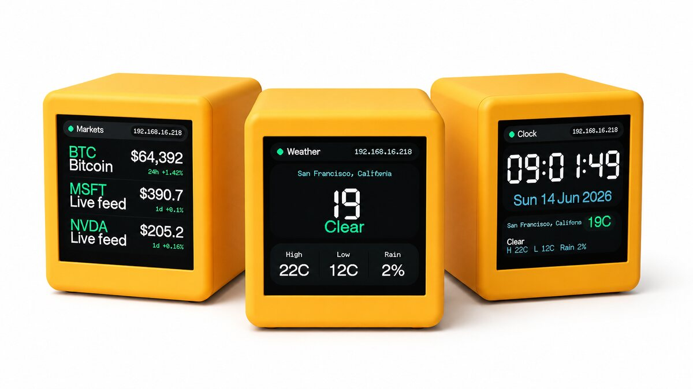
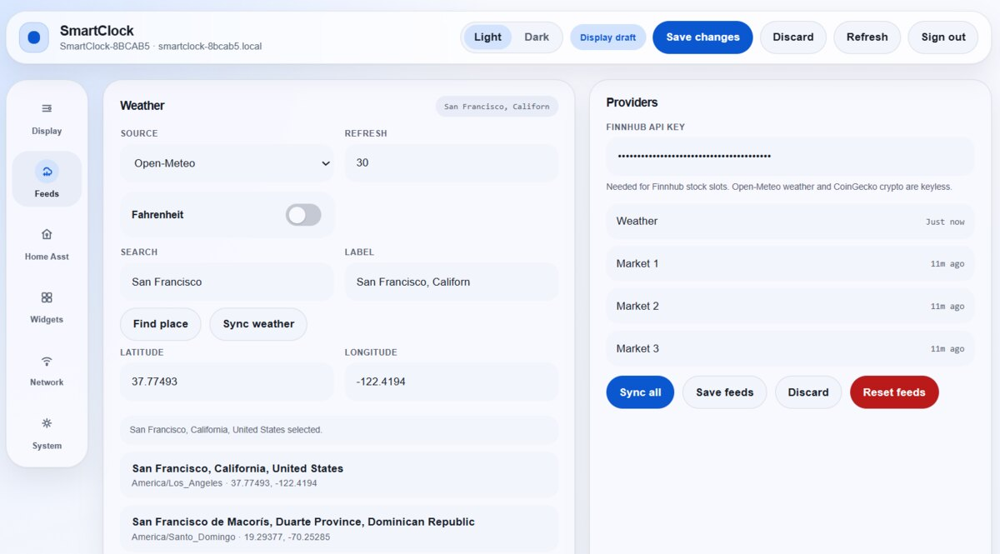
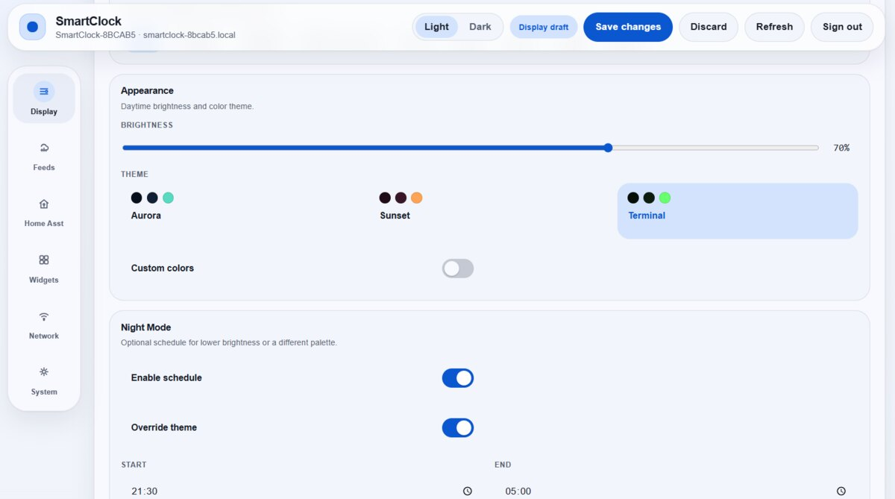
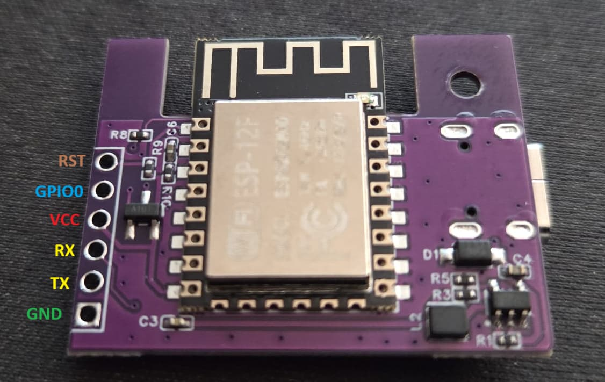

# GeekMagic SmallTV ESP8266 Firmware

Custom ESP8266 firmware for GeekMagic SmallTV-style smart weather clocks with a 240x240 ST7789 display. The firmware provides an authenticated web dashboard, WiFi setup, OTA updates, feed integrations, image display, and selected GeekMagic-style compatibility endpoints.

The project has been tested on the GeekMagic SmallTV Ultra ESP8266 variant. Other ESP8266-based variants may require pin or build-flag changes. The ESP32-based SmallTV Pro is not a target for this repository.

## Screenshots







## Features

- Authenticated web dashboard for display, feed, network, OTA, and system management
- ST7789 240x240 display support through TFT_eSPI
- Captive portal WiFi setup with randomized setup AP password
- mDNS discovery using the configured device hostname
- ArduinoOTA and web OTA using the current admin password
- LittleFS persistence for dashboard, feed, and authentication configuration
- EEPROM settings validation with firmware version and CRC checks
- NTP time synchronization with configurable UTC offset
- Day and night display profiles with scheduled brightness and theme options
- Multi-page display: clock, weather, markets, Home Assistant, focus timer, world clocks, event countdown, quote, and status pages
- Open-Meteo weather, Finnhub or CoinGecko market feeds, and Home Assistant REST polling
- Temporary JPEG upload and rendering
- Factory reset from the dashboard or by five quick power cycles

## Hardware

Target hardware:

- ESP8266 NodeMCU v2-compatible board
- ST7789 240x240 TFT display
- 4 MB flash recommended

Display and button pin mapping:

| Function | ESP8266 GPIO |
|----------|--------------|
| MOSI | GPIO13 |
| SCLK | GPIO14 |
| DC | GPIO0 |
| RST | GPIO2 |
| Backlight PWM | GPIO5 |
| Button | GPIO4 |

The active build flags are defined in `platformio.ini`.

The button on GPIO4 cycles to the next display page with a short press and toggles the backlight with a long press.

## Important Notes

Do not use OTA for the first installation from stock firmware, ESPHome, or another firmware. Flash the first firmware image over USB serial with a web flasher or local serial tool. OTA is only for devices already running this firmware.

Uploaded images are temporary. The firmware clears `/image/` on boot and resets stale image state.

The device uses flash-backed storage. Avoid automations that write settings or upload images at high frequency.

## Build Requirements

- Python 3.7 or newer
- PlatformIO Core or PlatformIO IDE
- USB access to the device for first installation

Install PlatformIO Core:

```bash
pip install platformio
```

Build the firmware:

```bash
pio run
```

The firmware binary is generated at:

```text
.pio/build/nodemcuv2/firmware.bin
```

Useful development commands:

```bash
pio run
pio run -t clean
pio run -t upload
pio device monitor
pio run -t size
```

The serial monitor runs at `115200` baud.

## First-Time Flashing

The recommended first-time flashing method is the [Spacehuhn ESP web flasher](https://esptool.spacehuhn.com/). On the tested device, no manual pin wiring is required.

1. Build the firmware with `pio run`, or download a release binary if one is available.
2. Connect the device to the computer with its normal USB cable.
3. Open `https://esptool.spacehuhn.com/` in a browser with Web Serial support, such as Chrome or Edge.
4. Click `Connect`.
5. Select the device serial port.
6. Select `.pio/build/nodemcuv2/firmware.bin`.
7. Start the flash process and wait for it to complete.

The web flasher handles entering flashing mode and restarting the device on boards with working USB serial auto-reset.

PlatformIO can also erase and flash over serial:

```bash
pio run -t erase
pio run -t upload
```

Specify a serial port if needed:

```bash
pio run -t upload --upload-port /dev/ttyUSB0
pio run -t upload --upload-port /dev/cu.usbserial-0001
pio run -t upload --upload-port COM3
```

Alternative esptool flow:

```bash
pip install esptool
esptool.py --port /dev/ttyUSB0 erase_flash
esptool.py --port /dev/ttyUSB0 write_flash 0x0 .pio/build/nodemcuv2/firmware.bin
```

If the web flasher cannot put the device into flashing mode automatically, use the manual bootloader pins as a fallback. Set any USB-to-TTL adapter to 3.3 V logic, cross TX and RX, connect GND, and hold GPIO0 to GND while powering the device.

| USB-to-TTL adapter | Board connector | Notes |
|--------------------|-----------------|-------|
| TX | RX | Crossed UART connection |
| RX | TX | Crossed UART connection |
| GND | GND | Shared ground |

| Board connector | Board connector | Purpose |
|-----------------|-----------------|---------|
| GPIO0 | GND | Enter flash mode |

Do not connect an adapter VCC pin to the board. Do not use 5 V logic.

The GeekMagic board UART connector is shown here:



After manual bootloader flashing, disconnect power, remove the GPIO0-to-GND jumper, and power the device normally.

## First Boot

If no WiFi credentials are stored, the device starts an access point named `SmartClock-Setup`.

Setup flow:

1. Read the setup AP password from the display or serial console.
2. Connect to `SmartClock-Setup`.
3. Open `http://192.168.4.1`.
4. Sign in as `admin` with the generated 10-digit admin password shown on the display or serial console.
5. Configure WiFi from the dashboard.
6. After the device reboots, open the configured hostname or assigned IP address.
7. Change the generated admin password from the dashboard.

The setup AP password and dashboard admin password are separate credentials. The AP password is an 8-digit random numeric password generated for AP mode. The admin password is a 10-digit random numeric password generated when `/auth.json` is missing.

## Hostname and Discovery

The default device name is generated from the chip ID, for example `SmartClock-1A2B3C`. The mDNS hostname is derived from the device name and usually follows this form:

```text
smartclock-1a2b3c.local
```

If the configured device name sanitizes to `smartclock`, the firmware appends the chip ID to avoid a generic hostname. mDNS starts only after WiFi is connected and enough heap is available.

The HTTP service advertises:

| Field | Value |
|-------|-------|
| Service | `_http._tcp` |
| Port | `80` |
| TXT `model` | `SmartClock` |
| TXT `vendor` | `Custom` |
| TXT `api` | `geekmagic` |
| TXT `name` | Configured device name |

## Dashboard

Open the device in a browser:

```text
http://<device-hostname>.local/
http://<device-ip>/
```

The root page loads without a session, but management actions require login.

Dashboard areas:

- Display: clock format, brightness, device name, UTC offset, themes, page rotation, header IP, and night mode
- Feeds: weather and market sources, provider credentials, and manual sync
- Home Asst: Home Assistant REST feed settings and entity slots
- Widgets: focus timer, world clocks, event countdown, quote, and status lines
- Network: WiFi scan, network join, and captive portal restart
- System: image upload, OTA update, logs, storage status, password rotation, test card, and factory reset

Most display changes can be previewed before saving.

## OTA Updates

OTA is available only after the firmware has been installed once over USB serial.

Web OTA:

1. Build the firmware with `pio run`.
2. Sign in to the dashboard.
3. Open the System tab or browse to `/update`.
4. Upload `.pio/build/nodemcuv2/firmware.bin`.

ArduinoOTA can be configured locally in PlatformIO:

```ini
upload_protocol = espota
upload_port = <device-hostname>.local
upload_flags = --auth=<current-admin-password>
```

Then upload:

```bash
pio run -t upload
```

ArduinoOTA starts after WiFi is connected, boot warmup has completed, recovery mode is not active, and sufficient heap is available.

## Recovery and Reset

The firmware has several recovery paths:

| Situation | Behavior |
|-----------|----------|
| Invalid settings version, CRC, or values | Settings reset to defaults |
| Legacy settings version 2 | Migrated to the current settings format when valid |
| Two consecutive early boot failures | Recovery boot mode starts with optional services disabled |
| WiFi connection failure | Failsafe AP mode starts and shows credentials on the display |
| Five quick manual power cycles | Full factory reset |
| Dashboard factory reset | Full factory reset |

The boot failure counter is cleared after the firmware has been running for 30 seconds. The power-cycle counter is cleared after 10 seconds of uptime, which prevents normal restarts from accidentally triggering factory reset.

To trigger the power-cycle factory reset, power cycle the device five times in quick succession. The reset clears WiFi credentials, EEPROM settings, authentication data, dashboard data, feed data, and uploaded images.

## Security Model

- Dashboard username is fixed as `admin`.
- Admin passwords must be 8 to 32 printable ASCII characters without spaces.
- A random 10-digit admin password is generated when auth storage is missing.
- Password hashes are stored in `/auth.json`.
- Session cookies are HTTP-only, strict same-site cookies with a 12-hour maximum age.
- The current admin password is also used for ArduinoOTA.
- HTTP traffic is not encrypted.

Use the device only on trusted networks. Do not expose the dashboard or API directly to the internet.

## Storage

| Storage | Contents |
|---------|----------|
| EEPROM | Core settings, validation data, boot counter, power-cycle counter |
| `/auth.json` | Admin password hash and provisioned password metadata |
| `/dashboard-config.json` | Display and page configuration |
| `/dashboard-data.json` | Widget data |
| `/feeds-config.json` | Feed provider configuration |
| `/image/` | Temporary uploaded JPEG files |

Default settings include brightness `70`, theme `0`, UTC offset `0`, and a generated device name.

## HTTP API

Base URL:

```text
http://<device-hostname>.local
http://<device-ip>
```

Public endpoints:

| Method | Endpoint | Description |
|--------|----------|-------------|
| GET | `/` | Dashboard shell |
| GET | `/auth/status` | Authentication state |
| POST | `/auth/login` | Start session |
| POST | `/auth/logout` | End session |
| POST | `/auth/reveal` | Show revealable generated admin password on device |

All other endpoints require a valid session cookie.

Login example:

```bash
curl -c cookies.txt \
  -X POST http://<device-ip>/auth/login \
  -H "Content-Type: application/json" \
  -d '{"username":"admin","password":"YOUR_ADMIN_PASSWORD"}'
```

Protected state endpoints:

| Method | Endpoint | Description |
|--------|----------|-------------|
| GET | `/app.json` | Runtime state |
| GET | `/dashboard.json` | Dashboard configuration and widget data |
| GET | `/feeds.json` | Feed configuration and runtime status |
| GET | `/space.json` | LittleFS total and free bytes |
| GET | `/brt.json` | Current brightness |
| GET | `/version.json` | Firmware version, device name, and hostname |
| GET | `/log` | In-memory log output |

Protected dashboard endpoints:

| Method | Endpoint | Description |
|--------|----------|-------------|
| POST | `/dashboard/live` | Preview display settings, config, or data |
| POST | `/dashboard/save` | Persist display settings, config, or data |
| POST | `/dashboard/discard` | Discard dashboard draft changes |
| POST | `/dashboard/reset` | Reset dashboard config and data |
| POST | `/dashboard/config` | Save dashboard config JSON directly |
| POST | `/dashboard/data` | Save dashboard data JSON directly |
| POST | `/api/dashboard` | Compatibility alias for dashboard data save |

Protected feed endpoints:

| Method | Endpoint | Description |
|--------|----------|-------------|
| POST | `/feeds/live` | Preview feed configuration |
| POST | `/feeds/save` | Persist feed configuration |
| POST | `/feeds/discard` | Discard feed draft changes |
| POST | `/feeds/reset` | Reset feed configuration |
| POST | `/feeds/sync?scope=all` | Sync feeds |
| GET | `/feeds/search?query=<text>` | Search weather locations |

Supported sync scopes are `all`, `weather`, `markets`, `home`, and `home-assistant`.

Protected image endpoints:

| Method | Endpoint | Description |
|--------|----------|-------------|
| POST | `/image/upload` | Upload JPEG image |
| POST | `/doUpload` | Compatibility image upload endpoint |
| POST | `/image/show` | Show uploaded image by path |
| POST | `/delete` | Delete uploaded image |

Image paths must stay under `/image/` and use `.jpg` or `.jpeg`.

Protected network and system endpoints:

| Method | Endpoint | Description |
|--------|----------|-------------|
| GET | `/scan` | Scan WiFi networks |
| POST | `/connect` | Connect to WiFi network |
| POST | `/reconfigurewifi` | Clear WiFi credentials and restart to setup mode |
| POST | `/factoryreset` | Factory reset and restart |
| POST | `/test` | Show test card |
| GET | `/update` | OTA upload form |
| POST | `/update` | OTA firmware upload |
| POST | `/auth/password` | Change admin password |

Common examples:

```bash
curl -b cookies.txt http://<device-ip>/app.json

curl -b cookies.txt \
  -X POST http://<device-ip>/dashboard/live \
  -H "Content-Type: application/json" \
  -d '{"settings":{"brightness":55,"gmtOffset":3600}}'

curl -b cookies.txt \
  -F "file=@image.jpg" \
  http://<device-ip>/image/upload

curl -b cookies.txt \
  -X POST http://<device-ip>/image/show \
  -H "Content-Type: application/json" \
  -d '{"path":"/image/image.jpg"}'

curl -b cookies.txt \
  -F "update=@.pio/build/nodemcuv2/firmware.bin" \
  http://<device-ip>/update
```

## Feed Integrations

Weather:

- Open-Meteo location-based weather
- Optional Fahrenheit display

Markets:

- Finnhub
- CoinGecko
- Three market slots

Home Assistant:

- REST API polling
- Up to four entity slots
- Optional custom labels and units
- Insecure/self-signed HTTPS mode or pinned certificate fingerprint mode

Feed configuration is stored in `/feeds-config.json`.

## Architecture

Main modules:

| Module | Responsibility |
|--------|----------------|
| `main.cpp` | Startup, WiFi, recovery, main loop, deferred mDNS/OTA/time services |
| `settings.cpp` | EEPROM settings, validation, migration, boot counters |
| `auth.cpp` | Admin password generation, hashing, verification, password rotation |
| `webserver.cpp` | HTTP routes, session checks, uploads, OTA, network actions |
| `webui.h` | Embedded dashboard HTML, CSS, and JavaScript |
| `dashboard.cpp` | Display configuration, widget data, live preview, persistence |
| `feeds.cpp` | Weather, market, and Home Assistant feed configuration and polling |
| `display.cpp` | ST7789 rendering, pages, brightness, images, setup screens |
| `button.cpp` | Button debounce and short/long press handling |
| `logger.cpp` | Serial and in-memory logs |

The ESP8266 runtime is cooperative. Long operations should yield, avoid large allocations, and avoid excessive filesystem writes.

## Contributing

Keep changes focused and test on hardware when behavior changes.

Before submitting changes:

```bash
pio run
```

Recommended validation:

- Serial upload succeeds.
- Device boots without reset loops.
- Display renders expected pages.
- WiFi setup, reconnect, and failsafe AP behavior work.
- Dashboard login and password rotation work.
- Settings persist across reboot.
- Feed sync succeeds or reports clear errors.
- OTA update succeeds.
- Factory reset works from the dashboard and power-cycle flow.
- Free heap remains stable during normal use.

When changing persistent settings, update defaults and validation, and bump `FIRMWARE_VERSION` in `src/settings.h` if the EEPROM layout changes.

## License

MIT
